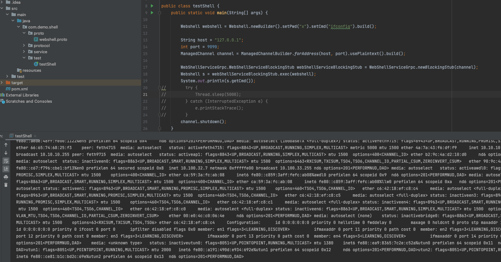

# grpc 内存马测试项目
绿盟分享的grpc内存马项目中没有poc，也没有考虑真实场景的攻击情况，此项目模拟真实攻击情况使用springboot+grpc作为服务端。所有的攻击代码都使用动态加载完成，默认攻击前提为能远程执行java代码。

# 使用说明

编译jar包，启动服务端
```
mvn package
java -jar grpc-1.0-SNAPSHOT.jar
```

使用grpc客户端连接8082端口，调用`webshell.exec()`执行命令
客户端参考grpc_client




# 参考链接
http://blog.nsfocus.net/grpc/
https://github.com/Snailll/gRPCDemo

